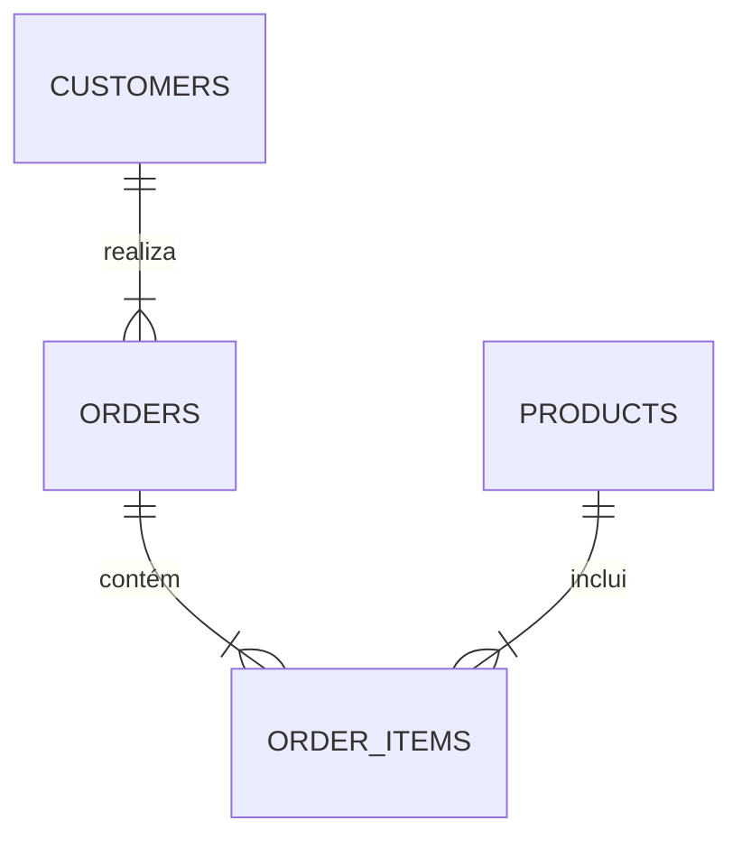

# Análise de Vendas e Logística - Superstore

## 📊 Contexto de Negócio
No cenário dinâmico do e-commerce, a eficiência logística e a otimização do portfólio de produtos são diferenciais competitivos cruciais. Este projeto tem como objetivo **analisar as vendas da rede Superstore** para identificar gargalos operacionais na cadeia de suprimentos e descobrir oportunidades de maximização de receita. Através de análises aprofundadas, buscamos responder perguntas estratégicas sobre o comportamento de vendas, rentabilidade de produtos e eficiência nas entregas.

## 🛠️ Ferramentas Utilizadas
- **Banco de Dados:** PostgreSQL
- **IDE/Gerenciamento:** DBeaver
- **Visualização e Dashboards:** Power BI

## 🏗️ Arquitetura dos Dados
Abaixo, a representação da arquitetura e relacionamento das entidades do nosso banco de dados:



> [!NOTE]
> **Placeholder:** Substitua o bloco mermaid acima ou insira o link/imagem do seu diagrama ER real (ex: ``).

## 💻 Principais Consultas e Técnicas (SQL)
Para garantir uma análise robusta e performática, foram empregadas técnicas avançadas de SQL:

- **CTEs (Common Table Expressions):** Utilizadas para modularizar consultas complexas, tornando o código mais legível e facilitando a manutenção da lógica de negócio.
- **Window Functions:** Aplicadas para o cálculo de métricas analíticas avançadas, como **médias móveis** de vendas e ranqueamento de produtos por categoria.
- **Joins Complexos:** Cruzamento de múltiplas tabelas (Vendas, Produtos, Clientes e Logística) para consolidar a visão holística das operações.

### Exemplo de Código: Cálculo de Média Móvel
```sql
WITH VendasDiarias AS (
    SELECT 
        data_pedido,
        SUM(valor_venda) AS total_vendas
    FROM 
        vendas
    GROUP BY 
        data_pedido
)
SELECT 
    data_pedido,
    total_vendas,
    AVG(total_vendas) OVER(ORDER BY data_pedido ROWS BETWEEN 6 PRECEDING AND CURRENT ROW) AS media_movel_7_dias
FROM 
    VendasDiarias;
```

## 📈 Insights Principais e Resultados
As análises revelaram descobertas críticas para a operação do negócio:
1. **Princípio de Pareto na Receita:** Descobrimos que **20% dos produtos** do catálogo são responsáveis por gerar **80% da receita** total da Superstore, indicando uma alta dependência de um grupo seleto de itens.
2. **Gargalos de Logística:** Foram identificadas rotas e categorias de frete com atrasos recorrentes, impactando diretamente a satisfação do cliente e elevando os custos de devolução.

## 🚀 Sugestões de Próximos Passos
Para evoluir esta solução e aprofundar o impacto analítico, sugerem-se as seguintes iniciativas:
- **Automatização de Pipelines:** Implementar fluxos de ETL (ex: com Apache Airflow) para atualização contínua do banco de dados PostgreSQL.
- **Modelagem Preditiva:** Utilizar algoritmos de Machine Learning em Python para prever a demanda dos produtos da "Curva A" (os 20% mais rentáveis) e evitar ruptura de estoque.
- **Análise de Cohort:** Desenvolver análises de retenção de clientes para entender o LTV (Life Time Value) ao longo do tempo.

---
*Desenvolvido por [TFS-Data](https://github.com/TFS-Data)*
